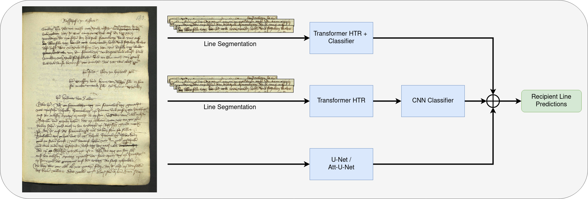
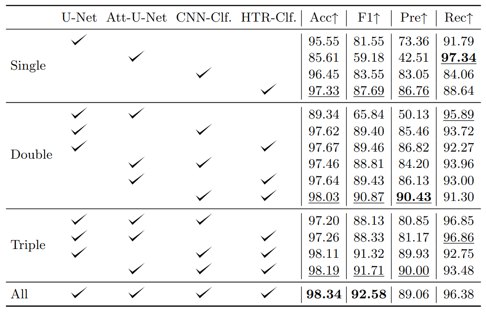
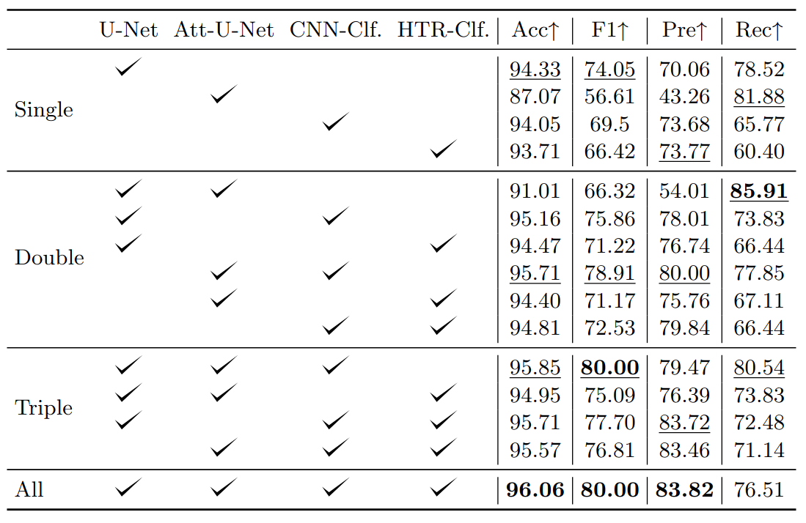

# Combining Visual and Linguistic Models for a Robust Recipient Line Recognition in Historical Documents 

## Abstract
_Automatically extracting targeted information from historical documents is an important task in the field of document analysis and eases the work of historians when dealing with huge corpora.
In this work, we investigate the idea of retrieving the recipient transcriptions from the Nuremberg letterbooks of the 15th century.
This task can be solved with fundamentally different ways of approaching it. First, detecting recipient lines solely based on visual features and without any explicit linguistic feedback. Here, we use a vanilla U-Net and an attention-based U-Net as representatives.
Second, linguistic feedback can be used to classify each line accordingly. This is done on the one hand with handwritten text recognition (HTR) for predicting the transcriptions and on top of it a light-wight natural language processing (NLP) model distinguishing whether the line is a recipient line or not. On the other hand, we adapt a named entity recognition transformer model. The system jointly performs the line transcription and the recipient line recognition.
For improving the performance we investigated all the possible combinations with the different methods.
In most cases the combined output probabilities outperformed the single approaches.
The best combination achieved on the hard test set an F1 score of 80% and recipient line recognition accuracy of about 96%, while the best single approach only reached about 74% and 94%, respectively._

## Results

 
